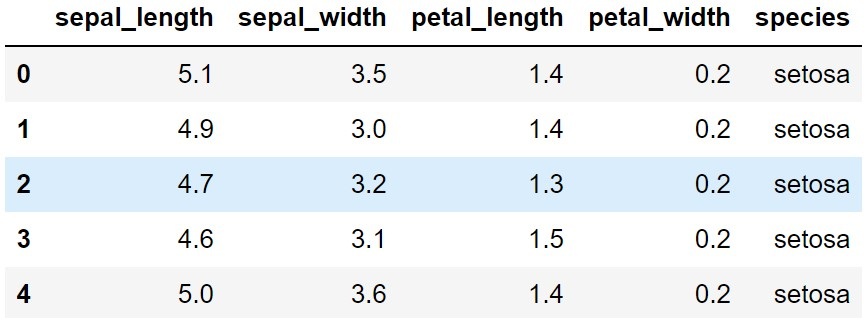
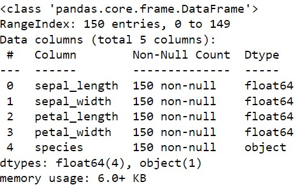
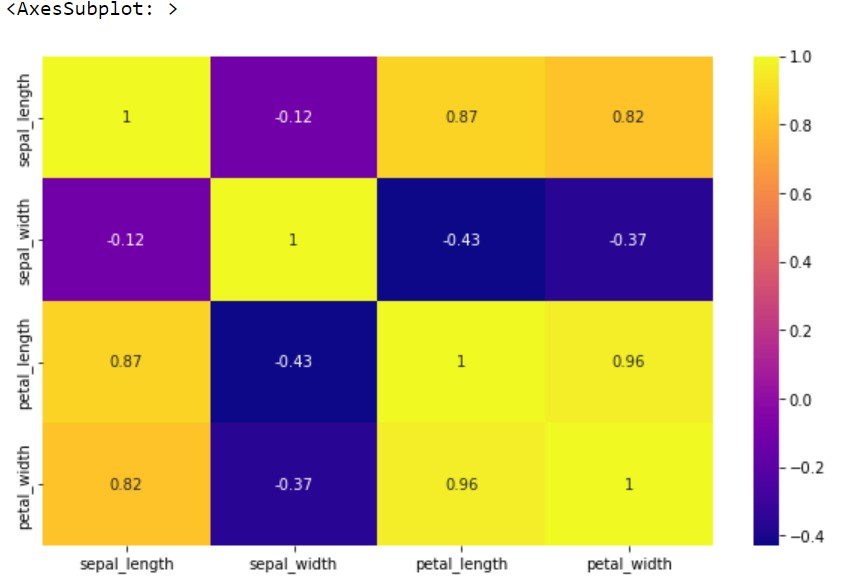
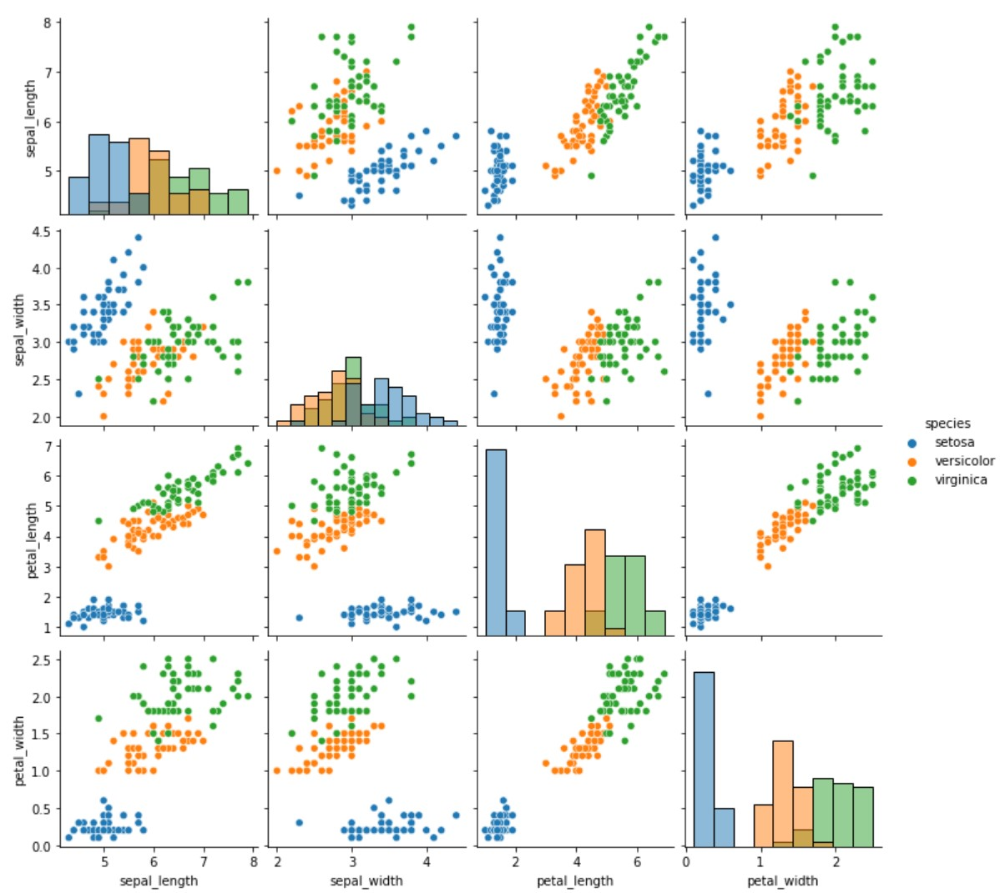
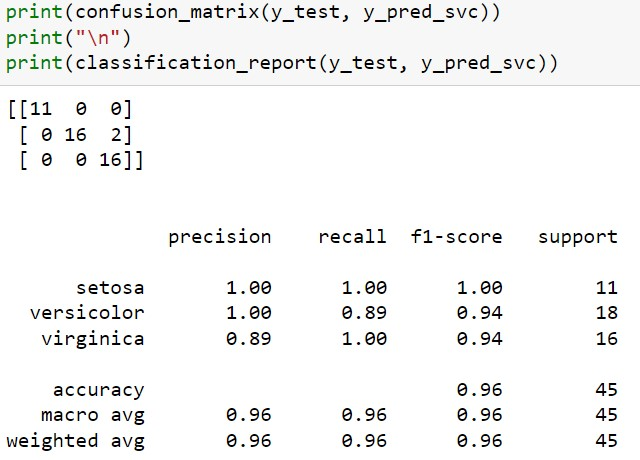
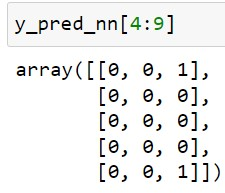
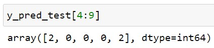

# Introduction

We classify Iris flower species using a [support vector classifier](https://en.wikipedia.org/wiki/Support_vector_machine) and a [neural network](https://en.wikipedia.org/wiki/Neural_network), and compare their performance.

The famous [Iris flower data set](https://en.wikipedia.org/wiki/Iris_flower_data_set) is studied here. It consists of 150 samples, distributed equally among Iris setosa, Iris virginica, Iris versicolor. Four features were measured from each sample: sepal length, speal width, petal length, and petal width, in centimetres.

**keywords:** data science, machine learning, deep learning, predictive modelling, exploratory data analysis, model evaluation

# Retrieving the Dataset

We begin by importing the standard libraries for data science and machine learning tasks.


```python
import pandas as pd
import numpy as np
import matplotlib.pyplot as plt
import seaborn as sns

import warnings
warnings.filterwarnings('ignore')

sns.color_palette("colorblind")

%matplotlib inline
```

The dataset is included in the [Seaborn](https://seaborn.pydata.org/) library. We can use the `.load_dataset()` function to view it as dataframe.


```python
iris = sns.load_dataset("iris")
```

Let us look at the first few rows of the dataframe to have a better idea on the dataset.

<figure>

</figure>

(screenshot of `iris.head()`)


```python
iris.head()
```


<div>
<style scoped>
    .dataframe tbody tr th:only-of-type {
        vertical-align: middle;
    }

    .dataframe tbody tr th {
        vertical-align: top;
    }

    .dataframe thead th {
        text-align: right;
    }
</style>
<table border="1" class="dataframe">
  <thead>
    <tr style="text-align: right;">
      <th></th>
      <th>sepal_length</th>
      <th>sepal_width</th>
      <th>petal_length</th>
      <th>petal_width</th>
      <th>species</th>
    </tr>
  </thead>
  <tbody>
    <tr>
      <th>0</th>
      <td>5.1</td>
      <td>3.5</td>
      <td>1.4</td>
      <td>0.2</td>
      <td>setosa</td>
    </tr>
    <tr>
      <th>1</th>
      <td>4.9</td>
      <td>3.0</td>
      <td>1.4</td>
      <td>0.2</td>
      <td>setosa</td>
    </tr>
    <tr>
      <th>2</th>
      <td>4.7</td>
      <td>3.2</td>
      <td>1.3</td>
      <td>0.2</td>
      <td>setosa</td>
    </tr>
    <tr>
      <th>3</th>
      <td>4.6</td>
      <td>3.1</td>
      <td>1.5</td>
      <td>0.2</td>
      <td>setosa</td>
    </tr>
    <tr>
      <th>4</th>
      <td>5.0</td>
      <td>3.6</td>
      <td>1.4</td>
      <td>0.2</td>
      <td>setosa</td>
    </tr>
  </tbody>
</table>
</div>


The columns **sepal_length**, **sepal_width**, **petal_length**, and **petal_width** represent four numerical features for each sample. Let us look at the distribution of each feature by using `.describe()`.


     
(screenshot of `iris.describe()`)


```python
iris.describe()
```


<div>
<style scoped>
    .dataframe tbody tr th:only-of-type {
        vertical-align: middle;
    }

    .dataframe tbody tr th {
        vertical-align: top;
    }

    .dataframe thead th {
        text-align: right;
    }
</style>
<table border="1" class="dataframe">
  <thead>
    <tr style="text-align: right;">
      <th></th>
      <th>sepal_length</th>
      <th>sepal_width</th>
      <th>petal_length</th>
      <th>petal_width</th>
    </tr>
  </thead>
  <tbody>
    <tr>
      <th>count</th>
      <td>150.000000</td>
      <td>150.000000</td>
      <td>150.000000</td>
      <td>150.000000</td>
    </tr>
    <tr>
      <th>mean</th>
      <td>5.843333</td>
      <td>3.057333</td>
      <td>3.758000</td>
      <td>1.199333</td>
    </tr>
    <tr>
      <th>std</th>
      <td>0.828066</td>
      <td>0.435866</td>
      <td>1.765298</td>
      <td>0.762238</td>
    </tr>
    <tr>
      <th>min</th>
      <td>4.300000</td>
      <td>2.000000</td>
      <td>1.000000</td>
      <td>0.100000</td>
    </tr>
    <tr>
      <th>25%</th>
      <td>5.100000</td>
      <td>2.800000</td>
      <td>1.600000</td>
      <td>0.300000</td>
    </tr>
    <tr>
      <th>50%</th>
      <td>5.800000</td>
      <td>3.000000</td>
      <td>4.350000</td>
      <td>1.300000</td>
    </tr>
    <tr>
      <th>75%</th>
      <td>6.400000</td>
      <td>3.300000</td>
      <td>5.100000</td>
      <td>1.800000</td>
    </tr>
    <tr>
      <th>max</th>
      <td>7.900000</td>
      <td>4.400000</td>
      <td>6.900000</td>
      <td>2.500000</td>
    </tr>
  </tbody>
</table>
</div>


It is worth noting that we have 150 records for each feature (from the **count** row of `iris.describe()`). This means there are no missing features (such as `np.NaN` and `None`) in this dataset.

Alternatively, we can use `.info()` to get the non-null count.


     
(screenshot of `iris.info()`)


```python
iris.info()
```

    <class 'pandas.core.frame.DataFrame'>
    RangeIndex: 150 entries, 0 to 149
    Data columns (total 5 columns):
     #   Column        Non-Null Count  Dtype  
    ---  ------        --------------  -----  
     0   sepal_length  150 non-null    float64
     1   sepal_width   150 non-null    float64
     2   petal_length  150 non-null    float64
     3   petal_width   150 non-null    float64
     4   species       150 non-null    object 
    dtypes: float64(4), object(1)
    memory usage: 6.0+ KB
    

# Exploratory Data Analysis

Let us create some data visuals to understand the data better.

Say we want to explore the correlations for each pair of (numerical) features in our dataset. We can first calculate the correlations using the `.corr()` method.


     
(screenshot of `.corr()`)


```python
iris.corr()
```


<div>
<style scoped>
    .dataframe tbody tr th:only-of-type {
        vertical-align: middle;
    }

    .dataframe tbody tr th {
        vertical-align: top;
    }

    .dataframe thead th {
        text-align: right;
    }
</style>
<table border="1" class="dataframe">
  <thead>
    <tr style="text-align: right;">
      <th></th>
      <th>sepal_length</th>
      <th>sepal_width</th>
      <th>petal_length</th>
      <th>petal_width</th>
    </tr>
  </thead>
  <tbody>
    <tr>
      <th>sepal_length</th>
      <td>1.000000</td>
      <td>-0.117570</td>
      <td>0.871754</td>
      <td>0.817941</td>
    </tr>
    <tr>
      <th>sepal_width</th>
      <td>-0.117570</td>
      <td>1.000000</td>
      <td>-0.428440</td>
      <td>-0.366126</td>
    </tr>
    <tr>
      <th>petal_length</th>
      <td>0.871754</td>
      <td>-0.428440</td>
      <td>1.000000</td>
      <td>0.962865</td>
    </tr>
    <tr>
      <th>petal_width</th>
      <td>0.817941</td>
      <td>-0.366126</td>
      <td>0.962865</td>
      <td>1.000000</td>
    </tr>
  </tbody>
</table>
</div>


A heatmap helps us to identify which two features are more correlated.


     
(screenshot of `sns.heatmap`)


```python
plt.figure(figsize = (10, 6))

sns.heatmap(iris.corr(),
            annot = True,
            cmap = "plasma"
           )
```


    <AxesSubplot: >


    

    


Let's create a pairplot.


```python
plt.figure( figsize = (12,6))

sns.pairplot(data = iris,
             hue = "species",
             diag_kind = "hist"
            )
```


    <seaborn.axisgrid.PairGrid at 0x18fbcf70670>


    <Figure size 864x432 with 0 Axes>


    

    


In particular, this `pairplot` is saying that the class setosa is highly separable from the rest. Here is a screenshot of the `pairplot`:



Seaborn allows us to visualise how **sepal_length** and **sepal_width** are jointly distributed for the setotsa class. This is done by `.kdeplot()`.


     
(screenshot of `sns.kdeplot()`)


```python
setosa = iris[iris["species"] == "setosa"]

sns.kdeplot(data = setosa,
            x = "sepal_width",
            y = "sepal_length",
            cmap = "plasma",
            fill = True,
            thresh = 0.09
           )
```


    <AxesSubplot: xlabel='sepal_width', ylabel='sepal_length'>


    

    


Thus, an average Iris setosa has sepal width 3.0--3.5 cm, and has sepal length 4.8--5.3 cm.

# Train-Test Split

We now divide our dataset into training set and testing set for our machine learning models.


```python
from sklearn.model_selection import train_test_split
from sklearn.preprocessing import LabelEncoder
```


```python
X = iris.drop("species", axis = 1)
y = iris["species"]

# Converting y into one-hot
encoder = LabelEncoder()
encoder.fit_transform(y)

# This is for SVC.
X_train, X_test, y_train, y_test = train_test_split(X, y, test_size = 0.3)
```

However, Tensorflow prefers one-hot-encoded labels in classification tasks. Therefore, we need to address that.


```python
'''
Prepare y_train, y_test for NN
'''

#Transform labels to normalized encoding.
y_train_nn = encoder.transform(y_train)

# Convert categorical variables into one-hot vectors
y_train_nn = pd.get_dummies(y_train_nn).values

# Repeat for y_test.
y_test_nn = encoder.transform(y_test)
y_test_nn = pd.get_dummies(y_test_nn).values
```

To illustrate:


# Training a Model

We train two models here: a support vector machine, and a dense neural network.

## Support Vector Classifier (SVC)

We call the SVC model from `sklearn` and use `.fit()` to fit it to the training data.


```python
from sklearn.svm import SVC

svc_model = SVC()

svc_model.fit(X_train, y_train)
```


<style>#sk-container-id-1 {color: black;background-color: white;}#sk-container-id-1 pre{padding: 0;}#sk-container-id-1 div.sk-toggleable {background-color: white;}#sk-container-id-1 label.sk-toggleable__label {cursor: pointer;display: block;width: 100%;margin-bottom: 0;padding: 0.3em;box-sizing: border-box;text-align: center;}#sk-container-id-1 label.sk-toggleable__label-arrow:before {content: "▸";float: left;margin-right: 0.25em;color: #696969;}#sk-container-id-1 label.sk-toggleable__label-arrow:hover:before {color: black;}#sk-container-id-1 div.sk-estimator:hover label.sk-toggleable__label-arrow:before {color: black;}#sk-container-id-1 div.sk-toggleable__content {max-height: 0;max-width: 0;overflow: hidden;text-align: left;background-color: #f0f8ff;}#sk-container-id-1 div.sk-toggleable__content pre {margin: 0.2em;color: black;border-radius: 0.25em;background-color: #f0f8ff;}#sk-container-id-1 input.sk-toggleable__control:checked~div.sk-toggleable__content {max-height: 200px;max-width: 100%;overflow: auto;}#sk-container-id-1 input.sk-toggleable__control:checked~label.sk-toggleable__label-arrow:before {content: "▾";}#sk-container-id-1 div.sk-estimator input.sk-toggleable__control:checked~label.sk-toggleable__label {background-color: #d4ebff;}#sk-container-id-1 div.sk-label input.sk-toggleable__control:checked~label.sk-toggleable__label {background-color: #d4ebff;}#sk-container-id-1 input.sk-hidden--visually {border: 0;clip: rect(1px 1px 1px 1px);clip: rect(1px, 1px, 1px, 1px);height: 1px;margin: -1px;overflow: hidden;padding: 0;position: absolute;width: 1px;}#sk-container-id-1 div.sk-estimator {font-family: monospace;background-color: #f0f8ff;border: 1px dotted black;border-radius: 0.25em;box-sizing: border-box;margin-bottom: 0.5em;}#sk-container-id-1 div.sk-estimator:hover {background-color: #d4ebff;}#sk-container-id-1 div.sk-parallel-item::after {content: "";width: 100%;border-bottom: 1px solid gray;flex-grow: 1;}#sk-container-id-1 div.sk-label:hover label.sk-toggleable__label {background-color: #d4ebff;}#sk-container-id-1 div.sk-serial::before {content: "";position: absolute;border-left: 1px solid gray;box-sizing: border-box;top: 0;bottom: 0;left: 50%;z-index: 0;}#sk-container-id-1 div.sk-serial {display: flex;flex-direction: column;align-items: center;background-color: white;padding-right: 0.2em;padding-left: 0.2em;position: relative;}#sk-container-id-1 div.sk-item {position: relative;z-index: 1;}#sk-container-id-1 div.sk-parallel {display: flex;align-items: stretch;justify-content: center;background-color: white;position: relative;}#sk-container-id-1 div.sk-item::before, #sk-container-id-1 div.sk-parallel-item::before {content: "";position: absolute;border-left: 1px solid gray;box-sizing: border-box;top: 0;bottom: 0;left: 50%;z-index: -1;}#sk-container-id-1 div.sk-parallel-item {display: flex;flex-direction: column;z-index: 1;position: relative;background-color: white;}#sk-container-id-1 div.sk-parallel-item:first-child::after {align-self: flex-end;width: 50%;}#sk-container-id-1 div.sk-parallel-item:last-child::after {align-self: flex-start;width: 50%;}#sk-container-id-1 div.sk-parallel-item:only-child::after {width: 0;}#sk-container-id-1 div.sk-dashed-wrapped {border: 1px dashed gray;margin: 0 0.4em 0.5em 0.4em;box-sizing: border-box;padding-bottom: 0.4em;background-color: white;}#sk-container-id-1 div.sk-label label {font-family: monospace;font-weight: bold;display: inline-block;line-height: 1.2em;}#sk-container-id-1 div.sk-label-container {text-align: center;}#sk-container-id-1 div.sk-container {/* jupyter's `normalize.less` sets `[hidden] { display: none; }` but bootstrap.min.css set `[hidden] { display: none !important; }` so we also need the `!important` here to be able to override the default hidden behavior on the sphinx rendered scikit-learn.org. See: https://github.com/scikit-learn/scikit-learn/issues/21755 */display: inline-block !important;position: relative;}#sk-container-id-1 div.sk-text-repr-fallback {display: none;}</style><div id="sk-container-id-1" class="sk-top-container"><div class="sk-text-repr-fallback"><pre>SVC()</pre><b>In a Jupyter environment, please rerun this cell to show the HTML representation or trust the notebook. <br />On GitHub, the HTML representation is unable to render, please try loading this page with nbviewer.org.</b></div><div class="sk-container" hidden><div class="sk-item"><div class="sk-estimator sk-toggleable"><input class="sk-toggleable__control sk-hidden--visually" id="sk-estimator-id-1" type="checkbox" checked><label for="sk-estimator-id-1" class="sk-toggleable__label sk-toggleable__label-arrow">SVC</label><div class="sk-toggleable__content"><pre>SVC()</pre></div></div></div></div></div>


## Evaluating SVC

We create a confusion matrix and a classification report for our SVC.


     
(screenshot of the confusion matrix and classsification report for SVC)


```python
from sklearn.metrics import classification_report,confusion_matrix
```


```python
y_pred_svc = svc_model.predict(X_test)

print(confusion_matrix(y_test, y_pred_svc))
print("\n")
print(classification_report(y_test, y_pred_svc))
```

    [[14  0  0]
     [ 0 12  0]
     [ 0  4 15]]
    
    
                  precision    recall  f1-score   support
    
          setosa       1.00      1.00      1.00        14
      versicolor       0.75      1.00      0.86        12
       virginica       1.00      0.79      0.88        19
    
        accuracy                           0.91        45
       macro avg       0.92      0.93      0.91        45
    weighted avg       0.93      0.91      0.91        45
    
    

As we can see, the SVC is a decent model.

# Dense Neural Network (NN)


```python
import tensorflow as tf
from tensorflow.keras.models import Sequential
from tensorflow.keras.layers import Dense
```

Our neural network is a fully-connected one.


```python
nn_model = Sequential()

# A good rule of thumb is that your first layer should match
# the same number of features for your NN.
nn_model.add(Dense(4, activation = "relu"))

nn_model.add(Dense(4, activation = "relu"))

# We are classifying 3 classes, so use "softmax".
nn_model.add(Dense(3, activation = "softmax"))

# Classification task uses "categorical_crossentropy".
nn_model.compile(optimizer='rmsprop',
              loss='categorical_crossentropy',
              metrics=['accuracy'])
```

Here is the model summary.


     
(screenshot of `nn_model.summary()`)

We fit our neural network to the training data for 500 epochs, and add in a batch size of 50.


```python
nn_model.fit(X_train.values, y_train_nn, batch_size=50, epochs=500)
```

    Epoch 1/500
    3/3 [==============================] - 1s 6ms/step - loss: 6.7795 - accuracy: 0.3429
    Epoch 2/500
    3/3 [==============================] - 0s 4ms/step - loss: 6.3892 - accuracy: 0.3429
    Epoch 3/500
    3/3 [==============================] - 0s 6ms/step - loss: 6.1339 - accuracy: 0.3429
    Epoch 4/500
    3/3 [==============================] - 0s 4ms/step - loss: 5.9452 - accuracy: 0.3429
    Epoch 5/500
    3/3 [==============================] - 0s 4ms/step - loss: 5.7569 - accuracy: 0.3429
    Epoch 6/500
    3/3 [==============================] - 0s 6ms/step - loss: 5.6077 - accuracy: 0.3429
    Epoch 7/500
    3/3 [==============================] - 0s 5ms/step - loss: 5.4614 - accuracy: 0.3429
    Epoch 8/500
    3/3 [==============================] - 0s 5ms/step - loss: 5.2988 - accuracy: 0.3429
    Epoch 9/500
    3/3 [==============================] - 0s 6ms/step - loss: 5.1854 - accuracy: 0.3429
    Epoch 10/500
    3/3 [==============================] - 0s 5ms/step - loss: 5.0524 - accuracy: 0.3429
    Epoch 11/500
    3/3 [==============================] - 0s 5ms/step - loss: 4.9331 - accuracy: 0.3429
    Epoch 12/500
    3/3 [==============================] - 0s 4ms/step - loss: 4.8011 - accuracy: 0.3429
    Epoch 13/500
    3/3 [==============================] - 0s 7ms/step - loss: 4.6671 - accuracy: 0.3429
    Epoch 14/500
    3/3 [==============================] - 0s 5ms/step - loss: 4.5454 - accuracy: 0.3429
    Epoch 15/500
    3/3 [==============================] - 0s 5ms/step - loss: 4.4217 - accuracy: 0.3429
    Epoch 16/500
    3/3 [==============================] - 0s 8ms/step - loss: 4.2883 - accuracy: 0.3429
    Epoch 17/500
    3/3 [==============================] - 0s 5ms/step - loss: 4.1858 - accuracy: 0.3429
    Epoch 18/500
    3/3 [==============================] - 0s 8ms/step - loss: 4.0678 - accuracy: 0.3429
    Epoch 19/500
    3/3 [==============================] - 0s 5ms/step - loss: 3.9569 - accuracy: 0.3429
    Epoch 20/500
    3/3 [==============================] - 0s 5ms/step - loss: 3.8596 - accuracy: 0.3429
    Epoch 21/500
    3/3 [==============================] - 0s 6ms/step - loss: 3.7490 - accuracy: 0.3429
    Epoch 22/500
    3/3 [==============================] - 0s 4ms/step - loss: 3.6607 - accuracy: 0.3429
    Epoch 23/500
    3/3 [==============================] - 0s 5ms/step - loss: 3.5467 - accuracy: 0.3429
    Epoch 24/500
    3/3 [==============================] - 0s 6ms/step - loss: 3.4542 - accuracy: 0.3429
    Epoch 25/500
    3/3 [==============================] - 0s 6ms/step - loss: 3.3609 - accuracy: 0.3429
    Epoch 26/500
    3/3 [==============================] - 0s 7ms/step - loss: 3.2893 - accuracy: 0.3429
    Epoch 27/500
    3/3 [==============================] - 0s 6ms/step - loss: 3.2124 - accuracy: 0.3429
    Epoch 28/500
    3/3 [==============================] - 0s 6ms/step - loss: 3.1219 - accuracy: 0.3429
    Epoch 29/500
    3/3 [==============================] - 0s 7ms/step - loss: 3.0412 - accuracy: 0.3429
    Epoch 30/500
    3/3 [==============================] - 0s 6ms/step - loss: 2.9522 - accuracy: 0.3429
    Epoch 31/500
    3/3 [==============================] - 0s 7ms/step - loss: 2.8679 - accuracy: 0.3429
    Epoch 32/500
    3/3 [==============================] - 0s 5ms/step - loss: 2.7960 - accuracy: 0.3429
    Epoch 33/500
    3/3 [==============================] - 0s 7ms/step - loss: 2.7131 - accuracy: 0.3429
    Epoch 34/500
    3/3 [==============================] - 0s 6ms/step - loss: 2.6398 - accuracy: 0.3429
    Epoch 35/500
    3/3 [==============================] - 0s 5ms/step - loss: 2.5642 - accuracy: 0.3429
    Epoch 36/500
    3/3 [==============================] - 0s 8ms/step - loss: 2.4936 - accuracy: 0.3429
    Epoch 37/500
    3/3 [==============================] - 0s 5ms/step - loss: 2.4346 - accuracy: 0.3429
    Epoch 38/500
    3/3 [==============================] - 0s 6ms/step - loss: 2.3695 - accuracy: 0.3429
    Epoch 39/500
    3/3 [==============================] - 0s 8ms/step - loss: 2.2996 - accuracy: 0.3429
    Epoch 40/500
    3/3 [==============================] - 0s 7ms/step - loss: 2.2430 - accuracy: 0.3429
    Epoch 41/500
    3/3 [==============================] - 0s 4ms/step - loss: 2.1853 - accuracy: 0.3429
    Epoch 42/500
    3/3 [==============================] - 0s 7ms/step - loss: 2.1208 - accuracy: 0.3429
    Epoch 43/500
    3/3 [==============================] - 0s 7ms/step - loss: 2.0644 - accuracy: 0.3429
    Epoch 44/500
    3/3 [==============================] - 0s 5ms/step - loss: 2.0096 - accuracy: 0.3429
    Epoch 45/500
    3/3 [==============================] - 0s 7ms/step - loss: 1.9538 - accuracy: 0.3429
    Epoch 46/500
    3/3 [==============================] - 0s 7ms/step - loss: 1.8948 - accuracy: 0.3429
    Epoch 47/500
    3/3 [==============================] - 0s 7ms/step - loss: 1.8532 - accuracy: 0.3429
    Epoch 48/500
    3/3 [==============================] - 0s 5ms/step - loss: 1.8072 - accuracy: 0.3429
    Epoch 49/500
    3/3 [==============================] - 0s 5ms/step - loss: 1.7617 - accuracy: 0.3429
    Epoch 50/500
    3/3 [==============================] - 0s 5ms/step - loss: 1.7181 - accuracy: 0.3429
    Epoch 51/500
    3/3 [==============================] - 0s 13ms/step - loss: 1.6709 - accuracy: 0.3429
    Epoch 52/500
    3/3 [==============================] - 0s 5ms/step - loss: 1.6356 - accuracy: 0.3429
    Epoch 53/500
    3/3 [==============================] - 0s 5ms/step - loss: 1.5897 - accuracy: 0.3429
    Epoch 54/500
    3/3 [==============================] - 0s 5ms/step - loss: 1.5490 - accuracy: 0.3429
    Epoch 55/500
    3/3 [==============================] - 0s 3ms/step - loss: 1.5073 - accuracy: 0.3429
    Epoch 56/500
    3/3 [==============================] - 0s 6ms/step - loss: 1.4758 - accuracy: 0.3429
    Epoch 57/500
    3/3 [==============================] - 0s 4ms/step - loss: 1.4368 - accuracy: 0.3429
    Epoch 58/500
    3/3 [==============================] - 0s 6ms/step - loss: 1.4049 - accuracy: 0.3429
    Epoch 59/500
    3/3 [==============================] - 0s 5ms/step - loss: 1.3712 - accuracy: 0.3429
    Epoch 60/500
    3/3 [==============================] - 0s 4ms/step - loss: 1.3376 - accuracy: 0.3429
    Epoch 61/500
    3/3 [==============================] - 0s 5ms/step - loss: 1.3054 - accuracy: 0.3429
    Epoch 62/500
    3/3 [==============================] - 0s 4ms/step - loss: 1.2778 - accuracy: 0.3429
    Epoch 63/500
    3/3 [==============================] - 0s 4ms/step - loss: 1.2521 - accuracy: 0.3429
    Epoch 64/500
    3/3 [==============================] - 0s 4ms/step - loss: 1.2242 - accuracy: 0.3429
    Epoch 65/500
    3/3 [==============================] - 0s 5ms/step - loss: 1.1983 - accuracy: 0.3429
    Epoch 66/500
    3/3 [==============================] - 0s 4ms/step - loss: 1.1746 - accuracy: 0.3429
    Epoch 67/500
    3/3 [==============================] - 0s 2ms/step - loss: 1.1484 - accuracy: 0.3429
    Epoch 68/500
    3/3 [==============================] - 0s 4ms/step - loss: 1.1238 - accuracy: 0.3429
    Epoch 69/500
    3/3 [==============================] - 0s 4ms/step - loss: 1.1070 - accuracy: 0.3429
    Epoch 70/500
    3/3 [==============================] - 0s 4ms/step - loss: 1.0886 - accuracy: 0.3429
    Epoch 71/500
    3/3 [==============================] - 0s 4ms/step - loss: 1.0698 - accuracy: 0.3429
    Epoch 72/500
    3/3 [==============================] - 0s 4ms/step - loss: 1.0576 - accuracy: 0.3429
    Epoch 73/500
    3/3 [==============================] - 0s 4ms/step - loss: 1.0442 - accuracy: 0.3429
    Epoch 74/500
    3/3 [==============================] - 0s 4ms/step - loss: 1.0276 - accuracy: 0.3429
    Epoch 75/500
    3/3 [==============================] - 0s 4ms/step - loss: 1.0109 - accuracy: 0.3429
    Epoch 76/500
    3/3 [==============================] - 0s 4ms/step - loss: 0.9983 - accuracy: 0.3429
    Epoch 77/500
    3/3 [==============================] - 0s 5ms/step - loss: 0.9849 - accuracy: 0.3429
    Epoch 78/500
    3/3 [==============================] - 0s 6ms/step - loss: 0.9733 - accuracy: 0.3429
    Epoch 79/500
    3/3 [==============================] - 0s 4ms/step - loss: 0.9648 - accuracy: 0.3429
    Epoch 80/500
    3/3 [==============================] - 0s 5ms/step - loss: 0.9528 - accuracy: 0.3429
    Epoch 81/500
    3/3 [==============================] - 0s 5ms/step - loss: 0.9419 - accuracy: 0.3429
    Epoch 82/500
    3/3 [==============================] - 0s 8ms/step - loss: 0.9304 - accuracy: 0.3429
    Epoch 83/500
    3/3 [==============================] - 0s 5ms/step - loss: 0.9209 - accuracy: 0.3429
    Epoch 84/500
    3/3 [==============================] - 0s 7ms/step - loss: 0.9124 - accuracy: 0.3429
    Epoch 85/500
    3/3 [==============================] - 0s 5ms/step - loss: 0.9015 - accuracy: 0.3524
    Epoch 86/500
    3/3 [==============================] - 0s 4ms/step - loss: 0.8923 - accuracy: 0.3524
    Epoch 87/500
    3/3 [==============================] - 0s 4ms/step - loss: 0.8838 - accuracy: 0.3810
    Epoch 88/500
    3/3 [==============================] - 0s 3ms/step - loss: 0.8736 - accuracy: 0.4095
    Epoch 89/500
    3/3 [==============================] - 0s 4ms/step - loss: 0.8666 - accuracy: 0.4286
    Epoch 90/500
    3/3 [==============================] - 0s 4ms/step - loss: 0.8586 - accuracy: 0.4381
    Epoch 91/500
    3/3 [==============================] - 0s 4ms/step - loss: 0.8528 - accuracy: 0.4476
    Epoch 92/500
    3/3 [==============================] - 0s 5ms/step - loss: 0.8474 - accuracy: 0.4571
    Epoch 93/500
    3/3 [==============================] - 0s 4ms/step - loss: 0.8396 - accuracy: 0.4762
    Epoch 94/500
    3/3 [==============================] - 0s 3ms/step - loss: 0.8320 - accuracy: 0.5048
    Epoch 95/500
    3/3 [==============================] - 0s 3ms/step - loss: 0.8249 - accuracy: 0.5714
    Epoch 96/500
    3/3 [==============================] - 0s 3ms/step - loss: 0.8190 - accuracy: 0.5905
    Epoch 97/500
    3/3 [==============================] - 0s 4ms/step - loss: 0.8114 - accuracy: 0.6095
    Epoch 98/500
    3/3 [==============================] - 0s 4ms/step - loss: 0.8056 - accuracy: 0.6000
    Epoch 99/500
    3/3 [==============================] - 0s 5ms/step - loss: 0.7980 - accuracy: 0.6476
    Epoch 100/500
    3/3 [==============================] - 0s 4ms/step - loss: 0.7908 - accuracy: 0.6952
    Epoch 101/500
    3/3 [==============================] - 0s 4ms/step - loss: 0.7847 - accuracy: 0.7333
    Epoch 102/500
    3/3 [==============================] - 0s 3ms/step - loss: 0.7783 - accuracy: 0.7714
    Epoch 103/500
    3/3 [==============================] - 0s 6ms/step - loss: 0.7722 - accuracy: 0.7714
    Epoch 104/500
    3/3 [==============================] - 0s 6ms/step - loss: 0.7646 - accuracy: 0.7714
    Epoch 105/500
    3/3 [==============================] - 0s 4ms/step - loss: 0.7578 - accuracy: 0.7619
    Epoch 106/500
    3/3 [==============================] - 0s 3ms/step - loss: 0.7503 - accuracy: 0.7619
    Epoch 107/500
    3/3 [==============================] - 0s 3ms/step - loss: 0.7423 - accuracy: 0.7333
    Epoch 108/500
    3/3 [==============================] - 0s 3ms/step - loss: 0.7365 - accuracy: 0.7238
    Epoch 109/500
    3/3 [==============================] - 0s 4ms/step - loss: 0.7301 - accuracy: 0.7048
    Epoch 110/500
    3/3 [==============================] - 0s 3ms/step - loss: 0.7230 - accuracy: 0.6857
    Epoch 111/500
    3/3 [==============================] - 0s 4ms/step - loss: 0.7177 - accuracy: 0.6857
    Epoch 112/500
    3/3 [==============================] - 0s 2ms/step - loss: 0.7131 - accuracy: 0.6857
    Epoch 113/500
    3/3 [==============================] - 0s 3ms/step - loss: 0.7088 - accuracy: 0.6952
    Epoch 114/500
    3/3 [==============================] - 0s 3ms/step - loss: 0.7044 - accuracy: 0.6952
    Epoch 115/500
    3/3 [==============================] - 0s 4ms/step - loss: 0.7006 - accuracy: 0.6952
    Epoch 116/500
    3/3 [==============================] - 0s 4ms/step - loss: 0.6966 - accuracy: 0.6857
    Epoch 117/500
    3/3 [==============================] - 0s 6ms/step - loss: 0.6933 - accuracy: 0.6952
    Epoch 118/500
    3/3 [==============================] - 0s 4ms/step - loss: 0.6906 - accuracy: 0.6952
    Epoch 119/500
    3/3 [==============================] - 0s 5ms/step - loss: 0.6879 - accuracy: 0.6952
    Epoch 120/500
    3/3 [==============================] - 0s 5ms/step - loss: 0.6852 - accuracy: 0.6952
    Epoch 121/500
    3/3 [==============================] - 0s 5ms/step - loss: 0.6825 - accuracy: 0.6952
    Epoch 122/500
    3/3 [==============================] - 0s 6ms/step - loss: 0.6808 - accuracy: 0.6952
    Epoch 123/500
    3/3 [==============================] - 0s 6ms/step - loss: 0.6778 - accuracy: 0.6952
    Epoch 124/500
    3/3 [==============================] - 0s 6ms/step - loss: 0.6746 - accuracy: 0.6952
    Epoch 125/500
    3/3 [==============================] - 0s 6ms/step - loss: 0.6728 - accuracy: 0.6952
    Epoch 126/500
    3/3 [==============================] - 0s 4ms/step - loss: 0.6713 - accuracy: 0.6952
    Epoch 127/500
    3/3 [==============================] - 0s 3ms/step - loss: 0.6690 - accuracy: 0.6952
    Epoch 128/500
    3/3 [==============================] - 0s 4ms/step - loss: 0.6660 - accuracy: 0.6952
    Epoch 129/500
    3/3 [==============================] - 0s 3ms/step - loss: 0.6637 - accuracy: 0.6952
    Epoch 130/500
    3/3 [==============================] - 0s 4ms/step - loss: 0.6614 - accuracy: 0.6952
    Epoch 131/500
    3/3 [==============================] - 0s 4ms/step - loss: 0.6599 - accuracy: 0.6952
    Epoch 132/500
    3/3 [==============================] - 0s 3ms/step - loss: 0.6573 - accuracy: 0.6952
    Epoch 133/500
    3/3 [==============================] - 0s 3ms/step - loss: 0.6549 - accuracy: 0.6952
    Epoch 134/500
    3/3 [==============================] - 0s 4ms/step - loss: 0.6534 - accuracy: 0.6952
    Epoch 135/500
    3/3 [==============================] - 0s 5ms/step - loss: 0.6517 - accuracy: 0.6952
    Epoch 136/500
    3/3 [==============================] - 0s 6ms/step - loss: 0.6496 - accuracy: 0.6952
    Epoch 137/500
    3/3 [==============================] - 0s 6ms/step - loss: 0.6480 - accuracy: 0.6952
    Epoch 138/500
    3/3 [==============================] - 0s 4ms/step - loss: 0.6466 - accuracy: 0.6952
    Epoch 139/500
    3/3 [==============================] - 0s 5ms/step - loss: 0.6445 - accuracy: 0.6952
    Epoch 140/500
    3/3 [==============================] - 0s 5ms/step - loss: 0.6430 - accuracy: 0.6952
    Epoch 141/500
    3/3 [==============================] - 0s 5ms/step - loss: 0.6415 - accuracy: 0.6952
    Epoch 142/500
    3/3 [==============================] - 0s 5ms/step - loss: 0.6397 - accuracy: 0.6952
    Epoch 143/500
    3/3 [==============================] - 0s 5ms/step - loss: 0.6382 - accuracy: 0.6952
    Epoch 144/500
    3/3 [==============================] - 0s 4ms/step - loss: 0.6367 - accuracy: 0.6952
    Epoch 145/500
    3/3 [==============================] - 0s 4ms/step - loss: 0.6351 - accuracy: 0.6952
    Epoch 146/500
    3/3 [==============================] - 0s 5ms/step - loss: 0.6336 - accuracy: 0.6952
    Epoch 147/500
    3/3 [==============================] - 0s 5ms/step - loss: 0.6320 - accuracy: 0.6952
    Epoch 148/500
    3/3 [==============================] - 0s 6ms/step - loss: 0.6308 - accuracy: 0.6952
    Epoch 149/500
    3/3 [==============================] - 0s 5ms/step - loss: 0.6293 - accuracy: 0.6952
    Epoch 150/500
    3/3 [==============================] - 0s 6ms/step - loss: 0.6279 - accuracy: 0.6952
    Epoch 151/500
    3/3 [==============================] - 0s 6ms/step - loss: 0.6264 - accuracy: 0.6952
    Epoch 152/500
    3/3 [==============================] - 0s 5ms/step - loss: 0.6254 - accuracy: 0.6952
    Epoch 153/500
    3/3 [==============================] - 0s 4ms/step - loss: 0.6241 - accuracy: 0.6952
    Epoch 154/500
    3/3 [==============================] - 0s 4ms/step - loss: 0.6225 - accuracy: 0.6952
    Epoch 155/500
    3/3 [==============================] - 0s 5ms/step - loss: 0.6212 - accuracy: 0.6952
    Epoch 156/500
    3/3 [==============================] - 0s 4ms/step - loss: 0.6199 - accuracy: 0.6952
    Epoch 157/500
    3/3 [==============================] - 0s 4ms/step - loss: 0.6186 - accuracy: 0.6952
    Epoch 158/500
    3/3 [==============================] - 0s 5ms/step - loss: 0.6173 - accuracy: 0.6952
    Epoch 159/500
    3/3 [==============================] - 0s 6ms/step - loss: 0.6160 - accuracy: 0.6952
    Epoch 160/500
    3/3 [==============================] - 0s 6ms/step - loss: 0.6150 - accuracy: 0.6952
    Epoch 161/500
    3/3 [==============================] - 0s 3ms/step - loss: 0.6140 - accuracy: 0.6952
    Epoch 162/500
    3/3 [==============================] - 0s 5ms/step - loss: 0.6128 - accuracy: 0.6952
    Epoch 163/500
    3/3 [==============================] - 0s 4ms/step - loss: 0.6119 - accuracy: 0.6952
    Epoch 164/500
    3/3 [==============================] - 0s 4ms/step - loss: 0.6107 - accuracy: 0.6952
    Epoch 165/500
    3/3 [==============================] - 0s 3ms/step - loss: 0.6095 - accuracy: 0.6952
    Epoch 166/500
    3/3 [==============================] - 0s 5ms/step - loss: 0.6084 - accuracy: 0.6952
    Epoch 167/500
    3/3 [==============================] - 0s 3ms/step - loss: 0.6074 - accuracy: 0.6952
    Epoch 168/500
    3/3 [==============================] - 0s 4ms/step - loss: 0.6064 - accuracy: 0.6952
    Epoch 169/500
    3/3 [==============================] - 0s 6ms/step - loss: 0.6053 - accuracy: 0.6952
    Epoch 170/500
    3/3 [==============================] - 0s 5ms/step - loss: 0.6043 - accuracy: 0.6952
    Epoch 171/500
    3/3 [==============================] - 0s 5ms/step - loss: 0.6035 - accuracy: 0.6952
    Epoch 172/500
    3/3 [==============================] - 0s 6ms/step - loss: 0.6025 - accuracy: 0.6952
    Epoch 173/500
    3/3 [==============================] - 0s 5ms/step - loss: 0.6015 - accuracy: 0.6952
    Epoch 174/500
    3/3 [==============================] - 0s 6ms/step - loss: 0.6006 - accuracy: 0.6952
    Epoch 175/500
    3/3 [==============================] - 0s 6ms/step - loss: 0.5997 - accuracy: 0.6952
    Epoch 176/500
    3/3 [==============================] - 0s 6ms/step - loss: 0.5987 - accuracy: 0.6952
    Epoch 177/500
    3/3 [==============================] - 0s 5ms/step - loss: 0.5981 - accuracy: 0.6952
    Epoch 178/500
    3/3 [==============================] - 0s 5ms/step - loss: 0.5969 - accuracy: 0.6952
    Epoch 179/500
    3/3 [==============================] - 0s 5ms/step - loss: 0.5962 - accuracy: 0.6952
    Epoch 180/500
    3/3 [==============================] - 0s 5ms/step - loss: 0.5951 - accuracy: 0.6952
    Epoch 181/500
    3/3 [==============================] - 0s 6ms/step - loss: 0.5944 - accuracy: 0.6952
    Epoch 182/500
    3/3 [==============================] - 0s 5ms/step - loss: 0.5934 - accuracy: 0.6952
    Epoch 183/500
    3/3 [==============================] - 0s 5ms/step - loss: 0.5927 - accuracy: 0.6952
    Epoch 184/500
    3/3 [==============================] - 0s 6ms/step - loss: 0.5919 - accuracy: 0.6952
    Epoch 185/500
    3/3 [==============================] - 0s 5ms/step - loss: 0.5911 - accuracy: 0.6952
    Epoch 186/500
    3/3 [==============================] - 0s 5ms/step - loss: 0.5905 - accuracy: 0.6952
    Epoch 187/500
    3/3 [==============================] - 0s 5ms/step - loss: 0.5896 - accuracy: 0.6952
    Epoch 188/500
    3/3 [==============================] - 0s 6ms/step - loss: 0.5889 - accuracy: 0.6952
    Epoch 189/500
    3/3 [==============================] - 0s 5ms/step - loss: 0.5881 - accuracy: 0.6952
    Epoch 190/500
    3/3 [==============================] - 0s 6ms/step - loss: 0.5874 - accuracy: 0.6952
    Epoch 191/500
    3/3 [==============================] - 0s 7ms/step - loss: 0.5867 - accuracy: 0.6952
    Epoch 192/500
    3/3 [==============================] - 0s 4ms/step - loss: 0.5860 - accuracy: 0.6952
    Epoch 193/500
    3/3 [==============================] - 0s 4ms/step - loss: 0.5852 - accuracy: 0.6952
    Epoch 194/500
    3/3 [==============================] - 0s 3ms/step - loss: 0.5846 - accuracy: 0.6952
    Epoch 195/500
    3/3 [==============================] - 0s 4ms/step - loss: 0.5839 - accuracy: 0.6952
    Epoch 196/500
    3/3 [==============================] - 0s 3ms/step - loss: 0.5833 - accuracy: 0.6952
    Epoch 197/500
    3/3 [==============================] - 0s 3ms/step - loss: 0.5826 - accuracy: 0.6952
    Epoch 198/500
    3/3 [==============================] - 0s 3ms/step - loss: 0.5819 - accuracy: 0.6952
    Epoch 199/500
    3/3 [==============================] - 0s 4ms/step - loss: 0.5812 - accuracy: 0.6952
    Epoch 200/500
    3/3 [==============================] - 0s 3ms/step - loss: 0.5805 - accuracy: 0.6952
    Epoch 201/500
    3/3 [==============================] - 0s 3ms/step - loss: 0.5798 - accuracy: 0.6952
    Epoch 202/500
    3/3 [==============================] - 0s 3ms/step - loss: 0.5792 - accuracy: 0.7048
    Epoch 203/500
    3/3 [==============================] - 0s 3ms/step - loss: 0.5786 - accuracy: 0.6952
    Epoch 204/500
    3/3 [==============================] - 0s 2ms/step - loss: 0.5775 - accuracy: 0.7048
    Epoch 205/500
    3/3 [==============================] - 0s 5ms/step - loss: 0.5770 - accuracy: 0.7048
    Epoch 206/500
    3/3 [==============================] - 0s 4ms/step - loss: 0.5764 - accuracy: 0.7048
    Epoch 207/500
    3/3 [==============================] - 0s 5ms/step - loss: 0.5758 - accuracy: 0.7048
    Epoch 208/500
    3/3 [==============================] - 0s 5ms/step - loss: 0.5753 - accuracy: 0.7048
    Epoch 209/500
    3/3 [==============================] - 0s 5ms/step - loss: 0.5748 - accuracy: 0.7048
    Epoch 210/500
    3/3 [==============================] - 0s 5ms/step - loss: 0.5741 - accuracy: 0.7048
    Epoch 211/500
    3/3 [==============================] - 0s 5ms/step - loss: 0.5734 - accuracy: 0.7048
    Epoch 212/500
    3/3 [==============================] - 0s 5ms/step - loss: 0.5728 - accuracy: 0.7048
    Epoch 213/500
    3/3 [==============================] - 0s 5ms/step - loss: 0.5721 - accuracy: 0.7048
    Epoch 214/500
    3/3 [==============================] - 0s 5ms/step - loss: 0.5716 - accuracy: 0.7048
    Epoch 215/500
    3/3 [==============================] - 0s 5ms/step - loss: 0.5708 - accuracy: 0.7048
    Epoch 216/500
    3/3 [==============================] - 0s 5ms/step - loss: 0.5701 - accuracy: 0.7048
    Epoch 217/500
    3/3 [==============================] - 0s 5ms/step - loss: 0.5695 - accuracy: 0.7048
    Epoch 218/500
    3/3 [==============================] - 0s 4ms/step - loss: 0.5690 - accuracy: 0.7048
    Epoch 219/500
    3/3 [==============================] - 0s 4ms/step - loss: 0.5684 - accuracy: 0.7048
    Epoch 220/500
    3/3 [==============================] - 0s 4ms/step - loss: 0.5677 - accuracy: 0.7048
    Epoch 221/500
    3/3 [==============================] - 0s 3ms/step - loss: 0.5672 - accuracy: 0.7048
    Epoch 222/500
    3/3 [==============================] - 0s 3ms/step - loss: 0.5664 - accuracy: 0.7048
    Epoch 223/500
    3/3 [==============================] - 0s 5ms/step - loss: 0.5659 - accuracy: 0.7048
    Epoch 224/500
    3/3 [==============================] - 0s 7ms/step - loss: 0.5652 - accuracy: 0.7048
    Epoch 225/500
    3/3 [==============================] - 0s 6ms/step - loss: 0.5649 - accuracy: 0.7048
    Epoch 226/500
    3/3 [==============================] - 0s 5ms/step - loss: 0.5642 - accuracy: 0.7048
    Epoch 227/500
    3/3 [==============================] - 0s 4ms/step - loss: 0.5633 - accuracy: 0.7048
    Epoch 228/500
    3/3 [==============================] - 0s 5ms/step - loss: 0.5626 - accuracy: 0.7048
    Epoch 229/500
    3/3 [==============================] - 0s 6ms/step - loss: 0.5619 - accuracy: 0.7048
    Epoch 230/500
    3/3 [==============================] - 0s 5ms/step - loss: 0.5613 - accuracy: 0.7048
    Epoch 231/500
    3/3 [==============================] - 0s 5ms/step - loss: 0.5606 - accuracy: 0.7048
    Epoch 232/500
    3/3 [==============================] - 0s 8ms/step - loss: 0.5599 - accuracy: 0.7048
    Epoch 233/500
    3/3 [==============================] - 0s 5ms/step - loss: 0.5593 - accuracy: 0.7048
    Epoch 234/500
    3/3 [==============================] - 0s 5ms/step - loss: 0.5585 - accuracy: 0.7048
    Epoch 235/500
    3/3 [==============================] - 0s 5ms/step - loss: 0.5577 - accuracy: 0.7048
    Epoch 236/500
    3/3 [==============================] - 0s 6ms/step - loss: 0.5571 - accuracy: 0.7048
    Epoch 237/500
    3/3 [==============================] - 0s 5ms/step - loss: 0.5564 - accuracy: 0.7048
    Epoch 238/500
    3/3 [==============================] - 0s 4ms/step - loss: 0.5558 - accuracy: 0.7048
    Epoch 239/500
    3/3 [==============================] - 0s 5ms/step - loss: 0.5552 - accuracy: 0.7048
    Epoch 240/500
    3/3 [==============================] - 0s 5ms/step - loss: 0.5548 - accuracy: 0.7048
    Epoch 241/500
    3/3 [==============================] - 0s 5ms/step - loss: 0.5542 - accuracy: 0.7048
    Epoch 242/500
    3/3 [==============================] - 0s 5ms/step - loss: 0.5537 - accuracy: 0.7048
    Epoch 243/500
    3/3 [==============================] - 0s 6ms/step - loss: 0.5531 - accuracy: 0.7048
    Epoch 244/500
    3/3 [==============================] - 0s 6ms/step - loss: 0.5524 - accuracy: 0.7048
    Epoch 245/500
    3/3 [==============================] - 0s 6ms/step - loss: 0.5519 - accuracy: 0.7048
    Epoch 246/500
    3/3 [==============================] - 0s 6ms/step - loss: 0.5513 - accuracy: 0.7048
    Epoch 247/500
    3/3 [==============================] - 0s 5ms/step - loss: 0.5507 - accuracy: 0.7048
    Epoch 248/500
    3/3 [==============================] - 0s 4ms/step - loss: 0.5501 - accuracy: 0.7048
    Epoch 249/500
    3/3 [==============================] - 0s 6ms/step - loss: 0.5496 - accuracy: 0.7048
    Epoch 250/500
    3/3 [==============================] - 0s 6ms/step - loss: 0.5491 - accuracy: 0.7048
    Epoch 251/500
    3/3 [==============================] - 0s 5ms/step - loss: 0.5484 - accuracy: 0.7048
    Epoch 252/500
    3/3 [==============================] - 0s 4ms/step - loss: 0.5480 - accuracy: 0.7048
    Epoch 253/500
    3/3 [==============================] - 0s 3ms/step - loss: 0.5475 - accuracy: 0.7048
    Epoch 254/500
    3/3 [==============================] - 0s 4ms/step - loss: 0.5469 - accuracy: 0.7048
    Epoch 255/500
    3/3 [==============================] - 0s 3ms/step - loss: 0.5466 - accuracy: 0.7048
    Epoch 256/500
    3/3 [==============================] - 0s 3ms/step - loss: 0.5461 - accuracy: 0.7048
    Epoch 257/500
    3/3 [==============================] - 0s 4ms/step - loss: 0.5456 - accuracy: 0.7048
    Epoch 258/500
    3/3 [==============================] - 0s 4ms/step - loss: 0.5451 - accuracy: 0.7048
    Epoch 259/500
    3/3 [==============================] - 0s 3ms/step - loss: 0.5446 - accuracy: 0.7048
    Epoch 260/500
    3/3 [==============================] - 0s 3ms/step - loss: 0.5441 - accuracy: 0.7048
    Epoch 261/500
    3/3 [==============================] - 0s 3ms/step - loss: 0.5434 - accuracy: 0.7048
    Epoch 262/500
    3/3 [==============================] - 0s 4ms/step - loss: 0.5430 - accuracy: 0.7048
    Epoch 263/500
    3/3 [==============================] - 0s 3ms/step - loss: 0.5424 - accuracy: 0.7048
    Epoch 264/500
    3/3 [==============================] - 0s 5ms/step - loss: 0.5420 - accuracy: 0.7048
    Epoch 265/500
    3/3 [==============================] - 0s 5ms/step - loss: 0.5414 - accuracy: 0.7048
    Epoch 266/500
    3/3 [==============================] - 0s 5ms/step - loss: 0.5409 - accuracy: 0.7048
    Epoch 267/500
    3/3 [==============================] - 0s 5ms/step - loss: 0.5402 - accuracy: 0.7048
    Epoch 268/500
    3/3 [==============================] - 0s 4ms/step - loss: 0.5396 - accuracy: 0.7048
    Epoch 269/500
    3/3 [==============================] - 0s 4ms/step - loss: 0.5390 - accuracy: 0.7048
    Epoch 270/500
    3/3 [==============================] - 0s 3ms/step - loss: 0.5385 - accuracy: 0.7048
    Epoch 271/500
    3/3 [==============================] - 0s 4ms/step - loss: 0.5381 - accuracy: 0.7048
    Epoch 272/500
    3/3 [==============================] - 0s 4ms/step - loss: 0.5376 - accuracy: 0.7048
    Epoch 273/500
    3/3 [==============================] - 0s 3ms/step - loss: 0.5371 - accuracy: 0.7048
    Epoch 274/500
    3/3 [==============================] - 0s 3ms/step - loss: 0.5367 - accuracy: 0.7048
    Epoch 275/500
    3/3 [==============================] - 0s 3ms/step - loss: 0.5361 - accuracy: 0.7048
    Epoch 276/500
    3/3 [==============================] - 0s 4ms/step - loss: 0.5356 - accuracy: 0.7048
    Epoch 277/500
    3/3 [==============================] - 0s 5ms/step - loss: 0.5350 - accuracy: 0.7048
    Epoch 278/500
    3/3 [==============================] - 0s 4ms/step - loss: 0.5343 - accuracy: 0.7048
    Epoch 279/500
    3/3 [==============================] - 0s 4ms/step - loss: 0.5339 - accuracy: 0.7048
    Epoch 280/500
    3/3 [==============================] - 0s 3ms/step - loss: 0.5334 - accuracy: 0.7048
    Epoch 281/500
    3/3 [==============================] - 0s 4ms/step - loss: 0.5331 - accuracy: 0.7048
    Epoch 282/500
    3/3 [==============================] - 0s 4ms/step - loss: 0.5324 - accuracy: 0.7048
    Epoch 283/500
    3/3 [==============================] - 0s 4ms/step - loss: 0.5319 - accuracy: 0.7048
    Epoch 284/500
    3/3 [==============================] - 0s 5ms/step - loss: 0.5313 - accuracy: 0.7048
    Epoch 285/500
    3/3 [==============================] - 0s 5ms/step - loss: 0.5307 - accuracy: 0.7048
    Epoch 286/500
    3/3 [==============================] - 0s 5ms/step - loss: 0.5301 - accuracy: 0.7048
    Epoch 287/500
    3/3 [==============================] - 0s 4ms/step - loss: 0.5297 - accuracy: 0.7048
    Epoch 288/500
    3/3 [==============================] - 0s 3ms/step - loss: 0.5292 - accuracy: 0.7048
    Epoch 289/500
    3/3 [==============================] - 0s 3ms/step - loss: 0.5287 - accuracy: 0.7048
    Epoch 290/500
    3/3 [==============================] - 0s 3ms/step - loss: 0.5283 - accuracy: 0.7048
    Epoch 291/500
    3/3 [==============================] - 0s 4ms/step - loss: 0.5278 - accuracy: 0.7048
    Epoch 292/500
    3/3 [==============================] - 0s 3ms/step - loss: 0.5272 - accuracy: 0.7048
    Epoch 293/500
    3/3 [==============================] - 0s 5ms/step - loss: 0.5269 - accuracy: 0.7048
    Epoch 294/500
    3/3 [==============================] - 0s 4ms/step - loss: 0.5262 - accuracy: 0.7048
    Epoch 295/500
    3/3 [==============================] - 0s 5ms/step - loss: 0.5259 - accuracy: 0.7048
    Epoch 296/500
    3/3 [==============================] - 0s 4ms/step - loss: 0.5253 - accuracy: 0.7048
    Epoch 297/500
    3/3 [==============================] - 0s 3ms/step - loss: 0.5246 - accuracy: 0.7048
    Epoch 298/500
    3/3 [==============================] - 0s 3ms/step - loss: 0.5240 - accuracy: 0.7048
    Epoch 299/500
    3/3 [==============================] - 0s 4ms/step - loss: 0.5235 - accuracy: 0.7048
    Epoch 300/500
    3/3 [==============================] - 0s 4ms/step - loss: 0.5231 - accuracy: 0.7048
    Epoch 301/500
    3/3 [==============================] - 0s 4ms/step - loss: 0.5227 - accuracy: 0.7048
    Epoch 302/500
    3/3 [==============================] - 0s 4ms/step - loss: 0.5222 - accuracy: 0.7048
    Epoch 303/500
    3/3 [==============================] - 0s 12ms/step - loss: 0.5216 - accuracy: 0.7048
    Epoch 304/500
    3/3 [==============================] - 0s 4ms/step - loss: 0.5211 - accuracy: 0.7048
    Epoch 305/500
    3/3 [==============================] - 0s 5ms/step - loss: 0.5206 - accuracy: 0.7048
    Epoch 306/500
    3/3 [==============================] - 0s 5ms/step - loss: 0.5203 - accuracy: 0.7048
    Epoch 307/500
    3/3 [==============================] - 0s 4ms/step - loss: 0.5197 - accuracy: 0.7048
    Epoch 308/500
    3/3 [==============================] - 0s 3ms/step - loss: 0.5190 - accuracy: 0.7048
    Epoch 309/500
    3/3 [==============================] - 0s 3ms/step - loss: 0.5185 - accuracy: 0.7048
    Epoch 310/500
    3/3 [==============================] - 0s 3ms/step - loss: 0.5180 - accuracy: 0.7048
    Epoch 311/500
    3/3 [==============================] - 0s 4ms/step - loss: 0.5177 - accuracy: 0.7048
    Epoch 312/500
    3/3 [==============================] - 0s 4ms/step - loss: 0.5171 - accuracy: 0.7048
    Epoch 313/500
    3/3 [==============================] - 0s 5ms/step - loss: 0.5167 - accuracy: 0.7048
    Epoch 314/500
    3/3 [==============================] - 0s 5ms/step - loss: 0.5163 - accuracy: 0.7048
    Epoch 315/500
    3/3 [==============================] - 0s 4ms/step - loss: 0.5157 - accuracy: 0.7048
    Epoch 316/500
    3/3 [==============================] - 0s 4ms/step - loss: 0.5153 - accuracy: 0.7048
    Epoch 317/500
    3/3 [==============================] - 0s 3ms/step - loss: 0.5147 - accuracy: 0.7048
    Epoch 318/500
    3/3 [==============================] - 0s 3ms/step - loss: 0.5144 - accuracy: 0.7048
    Epoch 319/500
    3/3 [==============================] - 0s 3ms/step - loss: 0.5138 - accuracy: 0.7048
    Epoch 320/500
    3/3 [==============================] - 0s 4ms/step - loss: 0.5134 - accuracy: 0.7048
    Epoch 321/500
    3/3 [==============================] - 0s 3ms/step - loss: 0.5129 - accuracy: 0.7048
    Epoch 322/500
    3/3 [==============================] - 0s 5ms/step - loss: 0.5124 - accuracy: 0.7048
    Epoch 323/500
    3/3 [==============================] - 0s 4ms/step - loss: 0.5119 - accuracy: 0.7048
    Epoch 324/500
    3/3 [==============================] - 0s 4ms/step - loss: 0.5115 - accuracy: 0.7048
    Epoch 325/500
    3/3 [==============================] - 0s 3ms/step - loss: 0.5113 - accuracy: 0.7048
    Epoch 326/500
    3/3 [==============================] - 0s 4ms/step - loss: 0.5107 - accuracy: 0.7048
    Epoch 327/500
    3/3 [==============================] - 0s 4ms/step - loss: 0.5104 - accuracy: 0.7048
    Epoch 328/500
    3/3 [==============================] - 0s 3ms/step - loss: 0.5099 - accuracy: 0.7048
    Epoch 329/500
    3/3 [==============================] - 0s 3ms/step - loss: 0.5097 - accuracy: 0.7048
    Epoch 330/500
    3/3 [==============================] - 0s 4ms/step - loss: 0.5093 - accuracy: 0.7048
    Epoch 331/500
    3/3 [==============================] - 0s 4ms/step - loss: 0.5089 - accuracy: 0.7048
    Epoch 332/500
    3/3 [==============================] - 0s 3ms/step - loss: 0.5086 - accuracy: 0.7048
    Epoch 333/500
    3/3 [==============================] - 0s 5ms/step - loss: 0.5081 - accuracy: 0.7048
    Epoch 334/500
    3/3 [==============================] - 0s 5ms/step - loss: 0.5076 - accuracy: 0.7048
    Epoch 335/500
    3/3 [==============================] - 0s 4ms/step - loss: 0.5073 - accuracy: 0.7048
    Epoch 336/500
    3/3 [==============================] - 0s 4ms/step - loss: 0.5069 - accuracy: 0.7048
    Epoch 337/500
    3/3 [==============================] - 0s 4ms/step - loss: 0.5065 - accuracy: 0.7048
    Epoch 338/500
    3/3 [==============================] - 0s 4ms/step - loss: 0.5060 - accuracy: 0.7048
    Epoch 339/500
    3/3 [==============================] - 0s 3ms/step - loss: 0.5056 - accuracy: 0.7048
    Epoch 340/500
    3/3 [==============================] - 0s 3ms/step - loss: 0.5052 - accuracy: 0.7048
    Epoch 341/500
    3/3 [==============================] - 0s 3ms/step - loss: 0.5046 - accuracy: 0.7048
    Epoch 342/500
    3/3 [==============================] - 0s 4ms/step - loss: 0.5042 - accuracy: 0.7048
    Epoch 343/500
    3/3 [==============================] - 0s 3ms/step - loss: 0.5039 - accuracy: 0.7048
    Epoch 344/500
    3/3 [==============================] - 0s 4ms/step - loss: 0.5036 - accuracy: 0.7048
    Epoch 345/500
    3/3 [==============================] - 0s 4ms/step - loss: 0.5032 - accuracy: 0.7048
    Epoch 346/500
    3/3 [==============================] - 0s 6ms/step - loss: 0.5028 - accuracy: 0.7048
    Epoch 347/500
    3/3 [==============================] - 0s 5ms/step - loss: 0.5023 - accuracy: 0.7048
    Epoch 348/500
    3/3 [==============================] - 0s 5ms/step - loss: 0.5019 - accuracy: 0.7048
    Epoch 349/500
    3/3 [==============================] - 0s 7ms/step - loss: 0.5015 - accuracy: 0.7048
    Epoch 350/500
    3/3 [==============================] - 0s 4ms/step - loss: 0.5013 - accuracy: 0.7048
    Epoch 351/500
    3/3 [==============================] - 0s 5ms/step - loss: 0.5007 - accuracy: 0.7048
    Epoch 352/500
    3/3 [==============================] - 0s 5ms/step - loss: 0.5005 - accuracy: 0.7048
    Epoch 353/500
    3/3 [==============================] - 0s 6ms/step - loss: 0.5002 - accuracy: 0.7048
    Epoch 354/500
    3/3 [==============================] - 0s 5ms/step - loss: 0.4996 - accuracy: 0.7048
    Epoch 355/500
    3/3 [==============================] - 0s 7ms/step - loss: 0.4992 - accuracy: 0.7048
    Epoch 356/500
    3/3 [==============================] - 0s 5ms/step - loss: 0.4990 - accuracy: 0.7048
    Epoch 357/500
    3/3 [==============================] - 0s 3ms/step - loss: 0.4986 - accuracy: 0.7048
    Epoch 358/500
    3/3 [==============================] - 0s 3ms/step - loss: 0.4983 - accuracy: 0.7048
    Epoch 359/500
    3/3 [==============================] - 0s 4ms/step - loss: 0.4979 - accuracy: 0.7048
    Epoch 360/500
    3/3 [==============================] - 0s 3ms/step - loss: 0.4975 - accuracy: 0.7048
    Epoch 361/500
    3/3 [==============================] - 0s 3ms/step - loss: 0.4970 - accuracy: 0.7048
    Epoch 362/500
    3/3 [==============================] - 0s 6ms/step - loss: 0.4968 - accuracy: 0.7048
    Epoch 363/500
    3/3 [==============================] - 0s 6ms/step - loss: 0.4970 - accuracy: 0.7048
    Epoch 364/500
    3/3 [==============================] - 0s 6ms/step - loss: 0.4958 - accuracy: 0.7048
    Epoch 365/500
    3/3 [==============================] - 0s 13ms/step - loss: 0.4953 - accuracy: 0.7048
    Epoch 366/500
    3/3 [==============================] - 0s 6ms/step - loss: 0.4951 - accuracy: 0.7048
    Epoch 367/500
    3/3 [==============================] - 0s 7ms/step - loss: 0.4948 - accuracy: 0.7048
    Epoch 368/500
    3/3 [==============================] - 0s 7ms/step - loss: 0.4940 - accuracy: 0.7048
    Epoch 369/500
    3/3 [==============================] - 0s 7ms/step - loss: 0.4937 - accuracy: 0.7048
    Epoch 370/500
    3/3 [==============================] - 0s 5ms/step - loss: 0.4933 - accuracy: 0.7048
    Epoch 371/500
    3/3 [==============================] - 0s 6ms/step - loss: 0.4929 - accuracy: 0.7048
    Epoch 372/500
    3/3 [==============================] - 0s 9ms/step - loss: 0.4929 - accuracy: 0.7048
    Epoch 373/500
    3/3 [==============================] - 0s 6ms/step - loss: 0.4921 - accuracy: 0.7048
    Epoch 374/500
    3/3 [==============================] - 0s 7ms/step - loss: 0.4918 - accuracy: 0.7048
    Epoch 375/500
    3/3 [==============================] - 0s 8ms/step - loss: 0.4912 - accuracy: 0.7048
    Epoch 376/500
    3/3 [==============================] - 0s 10ms/step - loss: 0.4908 - accuracy: 0.7048
    Epoch 377/500
    3/3 [==============================] - 0s 5ms/step - loss: 0.4905 - accuracy: 0.7048
    Epoch 378/500
    3/3 [==============================] - 0s 6ms/step - loss: 0.4901 - accuracy: 0.7048
    Epoch 379/500
    3/3 [==============================] - 0s 6ms/step - loss: 0.4903 - accuracy: 0.7048
    Epoch 380/500
    3/3 [==============================] - 0s 8ms/step - loss: 0.4897 - accuracy: 0.7048
    Epoch 381/500
    3/3 [==============================] - 0s 8ms/step - loss: 0.4891 - accuracy: 0.7048
    Epoch 382/500
    3/3 [==============================] - 0s 7ms/step - loss: 0.4886 - accuracy: 0.7048
    Epoch 383/500
    3/3 [==============================] - 0s 7ms/step - loss: 0.4882 - accuracy: 0.7048
    Epoch 384/500
    3/3 [==============================] - 0s 7ms/step - loss: 0.4881 - accuracy: 0.7048
    Epoch 385/500
    3/3 [==============================] - 0s 6ms/step - loss: 0.4875 - accuracy: 0.7048
    Epoch 386/500
    3/3 [==============================] - 0s 6ms/step - loss: 0.4879 - accuracy: 0.7048
    Epoch 387/500
    3/3 [==============================] - 0s 7ms/step - loss: 0.4870 - accuracy: 0.7048
    Epoch 388/500
    3/3 [==============================] - 0s 8ms/step - loss: 0.4866 - accuracy: 0.7048
    Epoch 389/500
    3/3 [==============================] - 0s 6ms/step - loss: 0.4866 - accuracy: 0.7048
    Epoch 390/500
    3/3 [==============================] - 0s 6ms/step - loss: 0.4856 - accuracy: 0.7048
    Epoch 391/500
    3/3 [==============================] - 0s 6ms/step - loss: 0.4853 - accuracy: 0.7048
    Epoch 392/500
    3/3 [==============================] - 0s 5ms/step - loss: 0.4852 - accuracy: 0.7048
    Epoch 393/500
    3/3 [==============================] - 0s 6ms/step - loss: 0.4847 - accuracy: 0.7048
    Epoch 394/500
    3/3 [==============================] - 0s 6ms/step - loss: 0.4842 - accuracy: 0.7048
    Epoch 395/500
    3/3 [==============================] - 0s 6ms/step - loss: 0.4838 - accuracy: 0.7048
    Epoch 396/500
    3/3 [==============================] - 0s 6ms/step - loss: 0.4832 - accuracy: 0.7048
    Epoch 397/500
    3/3 [==============================] - 0s 5ms/step - loss: 0.4834 - accuracy: 0.7048
    Epoch 398/500
    3/3 [==============================] - 0s 7ms/step - loss: 0.4826 - accuracy: 0.7048
    Epoch 399/500
    3/3 [==============================] - 0s 5ms/step - loss: 0.4822 - accuracy: 0.7048
    Epoch 400/500
    3/3 [==============================] - 0s 5ms/step - loss: 0.4817 - accuracy: 0.7048
    Epoch 401/500
    3/3 [==============================] - 0s 9ms/step - loss: 0.4814 - accuracy: 0.7048
    Epoch 402/500
    3/3 [==============================] - 0s 7ms/step - loss: 0.4811 - accuracy: 0.7048
    Epoch 403/500
    3/3 [==============================] - 0s 33ms/step - loss: 0.4807 - accuracy: 0.7048
    Epoch 404/500
    3/3 [==============================] - 0s 7ms/step - loss: 0.4804 - accuracy: 0.7048
    Epoch 405/500
    3/3 [==============================] - 0s 21ms/step - loss: 0.4800 - accuracy: 0.7048
    Epoch 406/500
    3/3 [==============================] - 0s 5ms/step - loss: 0.4796 - accuracy: 0.7048
    Epoch 407/500
    3/3 [==============================] - 0s 18ms/step - loss: 0.4794 - accuracy: 0.7048
    Epoch 408/500
    3/3 [==============================] - 0s 6ms/step - loss: 0.4790 - accuracy: 0.7048
    Epoch 409/500
    3/3 [==============================] - 0s 6ms/step - loss: 0.4784 - accuracy: 0.7048
    Epoch 410/500
    3/3 [==============================] - 0s 6ms/step - loss: 0.4781 - accuracy: 0.7048
    Epoch 411/500
    3/3 [==============================] - 0s 9ms/step - loss: 0.4780 - accuracy: 0.7048
    Epoch 412/500
    3/3 [==============================] - 0s 8ms/step - loss: 0.4772 - accuracy: 0.7048
    Epoch 413/500
    3/3 [==============================] - 0s 8ms/step - loss: 0.4770 - accuracy: 0.7048
    Epoch 414/500
    3/3 [==============================] - 0s 5ms/step - loss: 0.4764 - accuracy: 0.7048
    Epoch 415/500
    3/3 [==============================] - 0s 7ms/step - loss: 0.4760 - accuracy: 0.7048
    Epoch 416/500
    3/3 [==============================] - 0s 6ms/step - loss: 0.4757 - accuracy: 0.7048
    Epoch 417/500
    3/3 [==============================] - 0s 8ms/step - loss: 0.4753 - accuracy: 0.7048
    Epoch 418/500
    3/3 [==============================] - 0s 7ms/step - loss: 0.4749 - accuracy: 0.7048
    Epoch 419/500
    3/3 [==============================] - 0s 7ms/step - loss: 0.4744 - accuracy: 0.7048
    Epoch 420/500
    3/3 [==============================] - 0s 6ms/step - loss: 0.4737 - accuracy: 0.7048
    Epoch 421/500
    3/3 [==============================] - 0s 7ms/step - loss: 0.4733 - accuracy: 0.7048
    Epoch 422/500
    3/3 [==============================] - 0s 10ms/step - loss: 0.4731 - accuracy: 0.7048
    Epoch 423/500
    3/3 [==============================] - 0s 8ms/step - loss: 0.4728 - accuracy: 0.7048
    Epoch 424/500
    3/3 [==============================] - 0s 9ms/step - loss: 0.4723 - accuracy: 0.7048
    Epoch 425/500
    3/3 [==============================] - 0s 10ms/step - loss: 0.4720 - accuracy: 0.7048
    Epoch 426/500
    3/3 [==============================] - 0s 8ms/step - loss: 0.4715 - accuracy: 0.7048
    Epoch 427/500
    3/3 [==============================] - 0s 5ms/step - loss: 0.4715 - accuracy: 0.7048
    Epoch 428/500
    3/3 [==============================] - 0s 6ms/step - loss: 0.4706 - accuracy: 0.7048
    Epoch 429/500
    3/3 [==============================] - 0s 7ms/step - loss: 0.4704 - accuracy: 0.7048
    Epoch 430/500
    3/3 [==============================] - 0s 7ms/step - loss: 0.4699 - accuracy: 0.7048
    Epoch 431/500
    3/3 [==============================] - 0s 11ms/step - loss: 0.4698 - accuracy: 0.7048
    Epoch 432/500
    3/3 [==============================] - 0s 6ms/step - loss: 0.4698 - accuracy: 0.7048
    Epoch 433/500
    3/3 [==============================] - 0s 11ms/step - loss: 0.4686 - accuracy: 0.7048
    Epoch 434/500
    3/3 [==============================] - 0s 7ms/step - loss: 0.4683 - accuracy: 0.7048
    Epoch 435/500
    3/3 [==============================] - 0s 24ms/step - loss: 0.4682 - accuracy: 0.7048
    Epoch 436/500
    3/3 [==============================] - 0s 6ms/step - loss: 0.4676 - accuracy: 0.7048
    Epoch 437/500
    3/3 [==============================] - 0s 12ms/step - loss: 0.4672 - accuracy: 0.7048
    Epoch 438/500
    3/3 [==============================] - 0s 7ms/step - loss: 0.4668 - accuracy: 0.7048
    Epoch 439/500
    3/3 [==============================] - 0s 7ms/step - loss: 0.4668 - accuracy: 0.7048
    Epoch 440/500
    3/3 [==============================] - 0s 10ms/step - loss: 0.4665 - accuracy: 0.7048
    Epoch 441/500
    3/3 [==============================] - 0s 6ms/step - loss: 0.4656 - accuracy: 0.7048
    Epoch 442/500
    3/3 [==============================] - 0s 9ms/step - loss: 0.4651 - accuracy: 0.7048
    Epoch 443/500
    3/3 [==============================] - 0s 8ms/step - loss: 0.4651 - accuracy: 0.7048
    Epoch 444/500
    3/3 [==============================] - 0s 7ms/step - loss: 0.4643 - accuracy: 0.7048
    Epoch 445/500
    3/3 [==============================] - 0s 6ms/step - loss: 0.4640 - accuracy: 0.7048
    Epoch 446/500
    3/3 [==============================] - 0s 53ms/step - loss: 0.4641 - accuracy: 0.7048
    Epoch 447/500
    3/3 [==============================] - 0s 8ms/step - loss: 0.4633 - accuracy: 0.7048
    Epoch 448/500
    3/3 [==============================] - 0s 7ms/step - loss: 0.4630 - accuracy: 0.7048
    Epoch 449/500
    3/3 [==============================] - 0s 9ms/step - loss: 0.4625 - accuracy: 0.7048
    Epoch 450/500
    3/3 [==============================] - 0s 7ms/step - loss: 0.4621 - accuracy: 0.7048
    Epoch 451/500
    3/3 [==============================] - 0s 7ms/step - loss: 0.4619 - accuracy: 0.7048
    Epoch 452/500
    3/3 [==============================] - 0s 11ms/step - loss: 0.4613 - accuracy: 0.7048
    Epoch 453/500
    3/3 [==============================] - 0s 7ms/step - loss: 0.4610 - accuracy: 0.7048
    Epoch 454/500
    3/3 [==============================] - 0s 7ms/step - loss: 0.4606 - accuracy: 0.7048
    Epoch 455/500
    3/3 [==============================] - 0s 11ms/step - loss: 0.4601 - accuracy: 0.7048
    Epoch 456/500
    3/3 [==============================] - 0s 8ms/step - loss: 0.4603 - accuracy: 0.7048
    Epoch 457/500
    3/3 [==============================] - 0s 6ms/step - loss: 0.4591 - accuracy: 0.7048
    Epoch 458/500
    3/3 [==============================] - 0s 7ms/step - loss: 0.4590 - accuracy: 0.7048
    Epoch 459/500
    3/3 [==============================] - 0s 7ms/step - loss: 0.4585 - accuracy: 0.7048
    Epoch 460/500
    3/3 [==============================] - 0s 6ms/step - loss: 0.4577 - accuracy: 0.7048
    Epoch 461/500
    3/3 [==============================] - 0s 6ms/step - loss: 0.4569 - accuracy: 0.7048
    Epoch 462/500
    3/3 [==============================] - 0s 8ms/step - loss: 0.4562 - accuracy: 0.7048
    Epoch 463/500
    3/3 [==============================] - 0s 5ms/step - loss: 0.4560 - accuracy: 0.7048
    Epoch 464/500
    3/3 [==============================] - 0s 8ms/step - loss: 0.4559 - accuracy: 0.7048
    Epoch 465/500
    3/3 [==============================] - 0s 8ms/step - loss: 0.4553 - accuracy: 0.7048
    Epoch 466/500
    3/3 [==============================] - 0s 6ms/step - loss: 0.4546 - accuracy: 0.7048
    Epoch 467/500
    3/3 [==============================] - 0s 6ms/step - loss: 0.4540 - accuracy: 0.7048
    Epoch 468/500
    3/3 [==============================] - 0s 6ms/step - loss: 0.4538 - accuracy: 0.7048
    Epoch 469/500
    3/3 [==============================] - 0s 13ms/step - loss: 0.4537 - accuracy: 0.7048
    Epoch 470/500
    3/3 [==============================] - 0s 8ms/step - loss: 0.4531 - accuracy: 0.7048
    Epoch 471/500
    3/3 [==============================] - 0s 18ms/step - loss: 0.4532 - accuracy: 0.7048
    Epoch 472/500
    3/3 [==============================] - 0s 8ms/step - loss: 0.4521 - accuracy: 0.7048
    Epoch 473/500
    3/3 [==============================] - 0s 5ms/step - loss: 0.4522 - accuracy: 0.7048
    Epoch 474/500
    3/3 [==============================] - 0s 6ms/step - loss: 0.4518 - accuracy: 0.7048
    Epoch 475/500
    3/3 [==============================] - 0s 6ms/step - loss: 0.4511 - accuracy: 0.7048
    Epoch 476/500
    3/3 [==============================] - 0s 7ms/step - loss: 0.4514 - accuracy: 0.7048
    Epoch 477/500
    3/3 [==============================] - 0s 4ms/step - loss: 0.4508 - accuracy: 0.7048
    Epoch 478/500
    3/3 [==============================] - 0s 5ms/step - loss: 0.4500 - accuracy: 0.7048
    Epoch 479/500
    3/3 [==============================] - 0s 5ms/step - loss: 0.4501 - accuracy: 0.7048
    Epoch 480/500
    3/3 [==============================] - 0s 5ms/step - loss: 0.4495 - accuracy: 0.7048
    Epoch 481/500
    3/3 [==============================] - 0s 16ms/step - loss: 0.4495 - accuracy: 0.7048
    Epoch 482/500
    3/3 [==============================] - 0s 9ms/step - loss: 0.4488 - accuracy: 0.7048
    Epoch 483/500
    3/3 [==============================] - 0s 8ms/step - loss: 0.4485 - accuracy: 0.7048
    Epoch 484/500
    3/3 [==============================] - 0s 7ms/step - loss: 0.4481 - accuracy: 0.7048
    Epoch 485/500
    3/3 [==============================] - 0s 6ms/step - loss: 0.4476 - accuracy: 0.7048
    Epoch 486/500
    3/3 [==============================] - 0s 6ms/step - loss: 0.4473 - accuracy: 0.7048
    Epoch 487/500
    3/3 [==============================] - 0s 7ms/step - loss: 0.4468 - accuracy: 0.7048
    Epoch 488/500
    3/3 [==============================] - 0s 5ms/step - loss: 0.4466 - accuracy: 0.7048
    Epoch 489/500
    3/3 [==============================] - 0s 4ms/step - loss: 0.4463 - accuracy: 0.7048
    Epoch 490/500
    3/3 [==============================] - 0s 4ms/step - loss: 0.4460 - accuracy: 0.7048
    Epoch 491/500
    3/3 [==============================] - 0s 3ms/step - loss: 0.4459 - accuracy: 0.7048
    Epoch 492/500
    3/3 [==============================] - 0s 4ms/step - loss: 0.4451 - accuracy: 0.7048
    Epoch 493/500
    3/3 [==============================] - 0s 4ms/step - loss: 0.4444 - accuracy: 0.7048
    Epoch 494/500
    3/3 [==============================] - 0s 3ms/step - loss: 0.4445 - accuracy: 0.7048
    Epoch 495/500
    3/3 [==============================] - 0s 7ms/step - loss: 0.4436 - accuracy: 0.7048
    Epoch 496/500
    3/3 [==============================] - 0s 6ms/step - loss: 0.4428 - accuracy: 0.7048
    Epoch 497/500
    3/3 [==============================] - 0s 6ms/step - loss: 0.4432 - accuracy: 0.7048
    Epoch 498/500
    3/3 [==============================] - 0s 5ms/step - loss: 0.4419 - accuracy: 0.7048
    Epoch 499/500
    3/3 [==============================] - 0s 6ms/step - loss: 0.4414 - accuracy: 0.7048
    Epoch 500/500
    3/3 [==============================] - 0s 8ms/step - loss: 0.4414 - accuracy: 0.7048
    


    <keras.callbacks.History at 0x18fc8681100>


## Evaluating NN

We plot the loss, accuracy against epochs.


     
(screenshot of `pd.DataFrame(nn_model.history.history).plot()`)


```python
pd.DataFrame(nn_model.history.history).plot()
```


    <AxesSubplot: >


    

    


We have a nice trend here---the loss decreases steadily, and accuracy is oscillates around 80%.

Next, we create a confusion matrix and a classification report for our NN. Note that we need to convert the one-hot vectors back to the text-string labels. To illustrate:
     
<table>
  <tr>
    <td></td>
      <td>$\xrightarrow[]{\mathrm{np.argmax}}$ </td>
      <td></td>
    <td></td>
      <td>$\xrightarrow[]{\mathrm{encoder.inverse_transform()}}$ </td>
      <td></td>
    <td></td>
  </tr>
 </table>


```python
y_pred_nn = (nn_model.predict(X_test) > 0.5).astype("int32")
```

    2/2 [==============================] - 0s 6ms/step
    


```python
# Reversing pd.get_dummies
y_pred_nn = np.argmax(y_pred_nn, axis = 1)
```


```python
# Transform labels back to original encoding.
y_pred_nn = encoder.inverse_transform(y_pred_nn)
```

We create a confusion matrix and a classification report for our SVC.


     
(screenshot of the confusion matrix and classsification report for NN)


```python
print(confusion_matrix(y_test, y_pred_nn))
print("\n")
print(classification_report(y_test, y_pred_nn))
```

    [[14  0  0]
     [ 0 12  0]
     [ 4 15  0]]
    
    
                  precision    recall  f1-score   support
    
          setosa       0.78      1.00      0.88        14
      versicolor       0.44      1.00      0.62        12
       virginica       0.00      0.00      0.00        19
    
        accuracy                           0.58        45
       macro avg       0.41      0.67      0.50        45
    weighted avg       0.36      0.58      0.44        45
    
    

Again, this is a decent model.

# Comparing SVC and NN

Let us obtain the classification reports in dictionary forms.


```python
nn_report = classification_report(y_test, y_pred_nn, output_dict = True)
svc_report = classification_report(y_test, y_pred_svc, output_dict = True)
```

The following cell compares the performance of our SVC and NN.


```python
# species = ['setosa', 'versicolor', 'virginica']
species = list(nn_report.keys())[0:3]

criteria = ["precision", "recall", "f1-score"]

nn_name = "Neural Network"
svc_name = "Support Vector Machine"

# This variable counts the number of times
# SVC beats NN.
svc_win_count = 0


for specie in species:
    for criterion in criteria:
        nn_result = nn_report[specie][criterion]
        svc_result = svc_report[specie][criterion]
        
        if nn_result > svc_result:
            print(f"For {specie}, {nn_name} performs better on {criterion}.")
        
        elif nn_result == svc_result:
            print(f"For {specie}, two models are on par with each other on {criterion}.")
            
        else:
            svc_win_count += 1
            print(f"For {specie}, {svc_name} performs better on {criterion}.")

print(f"SVC stands out in {svc_win_count} out of 9 aspects.")
```

    For setosa, Support Vector Machine performs better on precision.
    For setosa, two models are on par with each other on recall.
    For setosa, Support Vector Machine performs better on f1-score.
    For versicolor, Support Vector Machine performs better on precision.
    For versicolor, two models are on par with each other on recall.
    For versicolor, Support Vector Machine performs better on f1-score.
    For virginica, Support Vector Machine performs better on precision.
    For virginica, Support Vector Machine performs better on recall.
    For virginica, Support Vector Machine performs better on f1-score.
    SVC stands out in 7 out of 9 aspects.
    

# Thank You.
